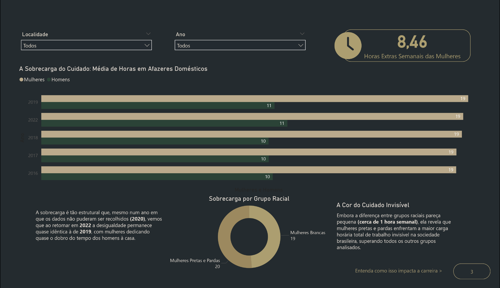
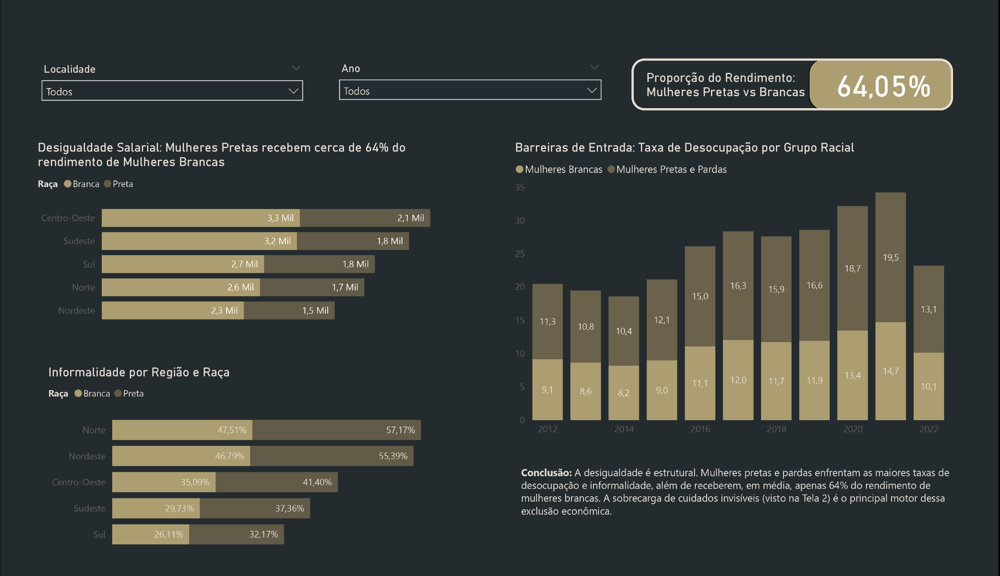

# Análise de Dados: Maternidade com Power BI 📊

Este projeto apresenta uma análise detalhada sobre [descreva aqui o objetivo da análise, ex: indicadores de saúde materna], utilizando o Power BI para a criação de dashboards interativos.

## 🖼️ Visualização do Dashboard
Abaixo, você pode conferir as telas principais do relatório:

## 📊 Principais Insights do Dashboard
* **O Abismo da Maternidade:** Existe um abismo de **34% de desigualdade** na ocupação; enquanto **87% dos pais** estão empregados, apenas **54% das mães** de crianças até 6 anos conseguem o mesmo.
* **Sobrecarga de Cuidado:** A desigualdade é estrutural. As mulheres dedicam quase o dobro do tempo dos homens a afazeres domésticos (média de **19h a 20h semanais** vs **10h a 11h** dos homens).
* **Desigualdade Racial e Salarial:** Mulheres pretas e pardas enfrentam as maiores taxas de informalidade e recebem, em média, apenas **64% do rendimento** de mulheres brancas.
* **Impacto da Pandemia:** Em 2020, o fechamento das creches impactou de forma imediata e severa a ocupação das mães, evidenciando a dependência de redes de apoio.

## 🛠️ Desafios Técnicos e Soluções
Este foi meu primeiro projeto no Power BI e envolveu um processo intenso de dados:
1. **ETL (Extração e Limpeza):** Consolidei **28 planilhas do IBGE** que estavam em formatos distintos e precisavam de padronização.
2. **Categorização:** Limpei e categorizei os dados para garantir que a análise regional (Norte, Nordeste, etc.) e racial estivesse correta.
3. **DAX e IA:** Utilizei Inteligência Artificial como parceira de pensamento para estruturar medidas DAX complexas, como taxas de desocupação e cálculos de rendimento proporcional.

## 📁 Arquivos do Projeto
* **`dados.zip`**: Bases de dados utilizadas para alimentar o modelo.
* **`projeto.pbix`**: Arquivo original do Power BI (para edição e consulta de fórmulas DAX).
* **`relatorio.pdf`**: Documentação exportada com os principais insights da análise.

## 🛠️ Tecnologias Utilizadas
* **Power BI**: Tratamento de dados (Power Query) e visualização.
* **Excel/CSV**: Fontes de dados.
* **GitHub**: Hospedagem e versionamento do projeto.

---
Desenvolvido por Natália Aguiar - [LinkedIn](https://www.linkedin.com/in/nataliaaguiars)
